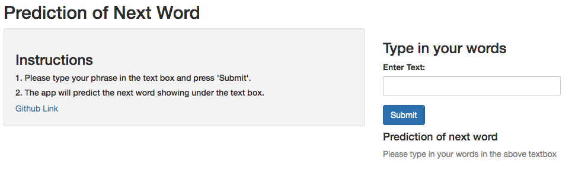

```{r setup, include=FALSE}
knitr::opts_chunk$set(echo = FALSE)
```


## Project Introduction
This project is to apply data science in the area of natural language processing. The English dataset provided by Coursera will be used as training data. The goal of the project is to build a prediction algorithm for predicting the next word. The following major tasks are completed:

1. Process the dataset provided by Coursera and generate a corpus based on the dataset
2. Generate tokens for the corpus and explore the frequencies of the tokens. 
3. Use n-gram method to build a prediction algorithm.
4. Build a Shiny app that takes as input a phrase in a text box input and outputs a predction of the next word.


## The Prediction Algorithm
The prediction algorithm is created based on the N-gram language modeling method. Here are the major steps:

1. Create a training corpus from sampling a total of 30,000 lines from training dataset, which is composed of data sourced from twitter, news, and blogs.
2. Use the text mining functions provided by the tm package to clean the training corpus including removing the profanity words.
3. Generate and explore the frequencies of the n-grams, namely uni-gram, bi-grams (two words), tri-grams (three words), and quad-grams (four words) from the training corpus.
4. Create a predition model based on a simple backoff method: matching the n-gram data from the higher-order (e.g. quad-grams) to the lower-order (e.g. uni-grams)


## The App
A Shiny app is created based on the n-gram prediction algorithm. In this app, user can input a phrase in the text box. The app will generate a prection of the next word.

[Shiny App](https://jh668.shinyapps.io/Prediction_of_Next_Word/)

```{r, echo=FALSE}
   
```


## Data Source and Source Codes
Data Link:
https://d396qusza40orc.cloudfront.net/dsscapstone/dataset/Coursera-SwiftKey.zip

Shiny App Link:
https://jh668.shinyapps.io/Prediction_of_Next_Word/

Github Repository for this Capstone Project Link:
https://github.com/jh668/Coursera-DS-Capstone